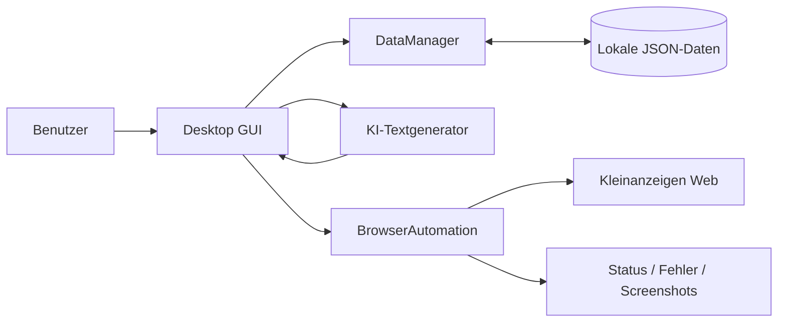

# Anzeigenchef – Project Showcase

> Private source repository · Public architecture & engineering showcase

## Kurzfassung

**Anzeigenchef** ist eine eigenständig entwickelte Python-Desktop-Anwendung zur Verwaltung und Automatisierung von Kleinanzeigen-Prozessen.

Das Projekt verbindet vier technische Bereiche in einer Anwendung:

1. **Desktop-GUI**
2. **lokale strukturierte Datenhaltung**
3. **Browser-Automatisierung**
4. **KI-gestützte Textgenerierung**

Der vollständige Produktivcode bleibt privat. Dieses Repository zeigt die Architektur, technische Entscheidungen und Engineering-Schwerpunkte des Projekts.

---

## Ziel des Projekts

Wiederkehrende Abläufe rund um Kleinanzeigen sollen nicht manuell über viele Einzelschritte abgearbeitet werden müssen. Anzeigenchef bündelt dafür Account-/Anzeigenverwaltung, Textgenerierung und browsergestützte Abläufe in einer Desktop-Anwendung.

Der Schwerpunkt liegt nicht auf einer einzelnen Funktion, sondern auf der **Integration mehrerer technischer Komponenten zu einem durchgängigen Workflow**.

---

## Tech Stack

| Bereich | Technologie |
|---|---|
| Sprache | Python 3.10+ |
| Desktop UI | CustomTkinter |
| Browser-Automatisierung | Playwright Sync API |
| Datenhaltung | lokale JSON-Dateien |
| KI | OpenAI API / ChatGPT-basierte Textgenerierung |
| Packaging | eigenes Build-Skript |
| Nebenläufigkeit | Hintergrund-Threads für lang laufende Aufgaben |

Abhängigkeiten im privaten Projekt umfassen u. a.:
- `customtkinter`
- `Pillow`
- `playwright`
- `plyer`

---

## Architektur

Die Anwendung ist funktional in klar definierte Verantwortungsbereiche getrennt:

### DataManager
Verantwortlich für:
- Laden und Speichern strukturierter lokaler Daten
- Verwaltung von Accounts und Anzeigen
- Konfigurationen
- automatische Backups bei Schreibvorgängen

### BrowserAutomation
Verantwortlich für:
- browsergestützte Abläufe mit Playwright
- zentrale Selektor-Konfiguration
- Erkennung problematischer Zustände
- nachvollziehbare Fehlerausgabe

### OpenAITextGenerator / ChatGPTWebGenerator
Verantwortlich für:
- KI-gestützte Textgenerierung
- Trennung der KI-Funktionalität von GUI und Datenhaltung

### KleinanzeigenManagerApp
Verantwortlich für:
- Desktop-Oberfläche
- Benutzerinteraktion
- Orchestrierung der einzelnen Komponenten

---

## Vereinfachter System- und Datenfluss



Der Ablauf ist bewusst komponentenorientiert:
- GUI nimmt Eingaben entgegen
- DataManager stellt strukturierte Daten bereit
- KI-Komponenten erzeugen Inhalte
- BrowserAutomation führt Web-Aktionen aus
- Status und Fehler werden zurück in die Anwendung gespiegelt

---

## Datenhaltung & Sicherheit

Lokale Daten werden bewusst außerhalb des Quellcodes gehalten.

Beispiele für lokale, nicht versionierte Daten:
- Account-Daten
- Anzeigen-Daten
- OpenAI-Konfiguration
- Browser-Session-Daten
- lokale Backups

Engineering-Regeln im Projekt:
- keine API-Keys oder Tokens im Quellcode
- keine Cookies oder Tokens in Logs
- lokale Daten nicht ins Repository einchecken
- Backup-System bei Schreibvorgängen
- klare Trennung von Anwendungscode und Zugangsdaten

---

## Robustheit der Browser-Automatisierung

Die Automatisierung berücksichtigt, dass Webseiten keine stabile API-Oberfläche darstellen.

Dafür gibt es u. a.:
- zentrale Selektor-Konfiguration
- mehrere Selektor-Varianten je UI-Element
- Retry-Mechanismen
- Erkennung von Login-Weiterleitungen / Sperrzuständen
- Fehlerstatus statt blindem Erfolg
- Screenshots zur Diagnose
- Logging des jeweiligen Automationsschritts

Automationsläufe unterscheiden Zustände wie:
- **ERFOLGREICH**
- **UNKLAR**
- **FEHLER**

Damit wird Unsicherheit explizit behandelt statt ein Ergebnis nur binär anzunehmen.

---

## Engineering-Prinzipien

### Klare Verantwortlichkeiten
Datenhaltung, Browser-Automatisierung, GUI und KI-Logik sind logisch voneinander getrennt.

### Minimalinvasive Änderungen
Neue Funktionen sollen bestehende Abläufe nicht unnötig umbauen.

### Nachvollziehbare Fehler
Fehler sollen Schritt, Kontext und möglichst einen Screenshot liefern.

### Nebenläufigkeit
Lang laufende Prozesse werden in Hintergrund-Threads ausgeführt, damit die Oberfläche responsiv bleibt.

### Änderbare Web-Schnittstellen
Selektoren sind zentral gehalten, um Website-Änderungen gezielt abfangen zu können.

---

## Entwicklungs- und Qualitätsworkflow

Das Projekt nutzt einen definierten Workflow für Änderungen:

```text
Anforderung
   ↓
gezielte Änderung
   ↓
Python-Syntaxprüfung
   ↓
manueller Anwendungstest
   ↓
Git-Commit
```

Verwendete Checks:
- `python -m py_compile main.py`
- `python -m compileall .`
- manueller GUI-/Flow-Test

Im Projekt existieren außerdem strukturierte Entwicklungsanweisungen und Skills für Syntaxchecks, Feature-Planung und Entwicklungsabläufe.

---

## Warum dieses Projekt technisch relevant ist

Anzeigenchef zeigt nicht nur Python-Syntax, sondern die **Zusammenführung mehrerer Systeme und Verantwortlichkeiten**:

- UI
- persistente Daten
- externe Web-Oberfläche
- KI-Service
- Fehlerbehandlung
- Logging
- Security-Aspekte
- Workflow-Orchestrierung

Damit ist das Projekt besonders relevant für Rollen, bei denen **Integration, Schnittstellen, Datenflüsse, Systemdenken und technische Umsetzung** zusammenkommen.

---

## Bezug zu System Architecture / Data & AI

Das Projekt demonstriert praktische Erfahrung in Themen wie:

- Zerlegung eines Systems in Verantwortungsbereiche
- Schnittstellen zwischen UI, Datenhaltung, KI und Automation
- strukturierte Datenflüsse
- Integration externer Dienste
- sichere Behandlung sensibler Konfiguration
- Fehler- und Betriebsaspekte
- technische Dokumentation
- iterative Produktentwicklung

Es ist kein Enterprise-Architekturprojekt und erhebt diesen Anspruch auch nicht. Es zeigt jedoch praktisch, wie aus mehreren technischen Bausteinen eine funktionsfähige Anwendung entsteht.

---

## Repository-Struktur des privaten Projekts

```text
anzeigenchef/
├── main.py
├── build.py
├── requirements.txt
├── CLAUDE.md
├── SKILLS.md
├── .claude/
└── .gitignore
```

Die private Codebasis enthält die vollständige Anwendung. Dieses öffentliche Showcase-Repository veröffentlicht bewusst keine Zugangsdaten, Session-Daten oder privaten Nutzerdaten.

---

## Status

Aktiver Entwicklungsstand im privaten Repository.

## Hinweis

Dieses Repository dient ausschließlich als **technischer Showcase**.  
Der vollständige Quellcode und sensible Konfigurationsdaten bleiben privat.
